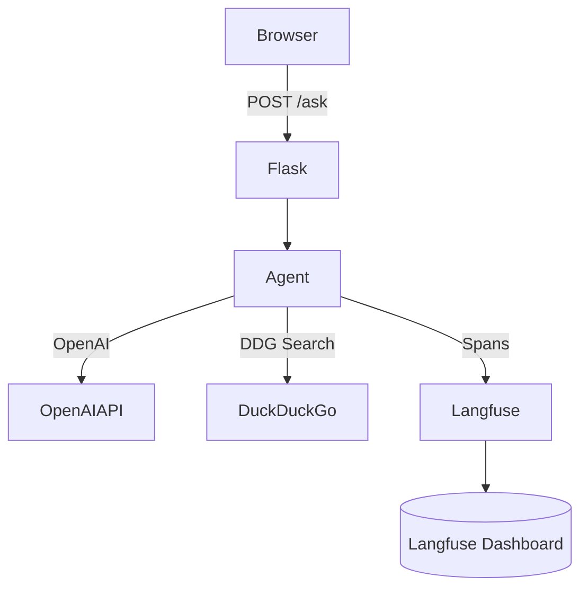

# Langfuse-Tutorial – Question-Answering Web App

A Flask-based web application that provides natural language question answering capabilities with web search integration and observability through Langfuse.

## Overview

This project demonstrates how to build a simple but powerful question-answering system using LangGraph, OpenAI, and DuckDuckGo search. The application automatically determines when to search the web for information and provides clear, concise answers with source citations. All operations are traced using Langfuse for comprehensive observability.


## Features

- Natural language question answering with OpenAI's GPT-4o mini
- Automatic detection of questions that require web research
- Integration with DuckDuckGo for real-time information retrieval
- Complete observability with Langfuse tracing for all operations
- Simple, clean web interface
- Environment-based configuration

## Tech Stack / Architecture

- **Backend**: Python 3.10+, Flask
- **AI/ML**: OpenAI API, LangGraph
- **Search**: DuckDuckGo Search API, BeautifulSoup4
- **Observability**: Langfuse
- **Frontend**: HTML, CSS, Jinja2 templates



## Directory Layout

```
.
├─ app.py              # Flask server
├─ agent.py            # LangGraph agent logic
├─ search.py           # DuckDuckGo helper
├─ templates/          # Jinja2 HTML templates
├─ static/style.css    # Styling
└─ requirements.txt    # Dependencies
```

## Prerequisites

- Python 3.10 or higher
- OpenAI API key
- Langfuse account (or local Langfuse instance)

## Setup

1. Clone the repository:
   ```bash
   git clone https://github.com/agentversity/langfuse-demo.git

   cd langfuse-tutorial
   ```

2. Create and activate a virtual environment:
   ```bash
   python -m venv .venv
   source .venv/bin/activate  # On Windows: .venv\Scripts\activate
   ```

3. Install dependencies:
   ```bash
   pip install -r requirements.txt
   ```

4. Set up environment variables:
   ```bash
   cp .env.example .env
   ```
   
   Then edit the `.env` file to add your API keys:
   ```
   # OpenAI API Key
   OPENAI_API_KEY=your_openai_api_key

   # Langfuse Configuration
   LANGFUSE_PUBLIC_KEY=your_langfuse_public_key
   LANGFUSE_SECRET_KEY=your_langfuse_secret_key
   LANGFUSE_HOST=https://cloud.langfuse.com  # Or http://localhost:3000 for local instance
   
   # Optional: Prompt Management Configuration
   PROMPT_LABEL=development  # Label to use when fetching prompts from Langfuse
   ```

## Running Locally

Start the Flask development server:
```bash
python app.py
```

The application will be available at http://127.0.0.1:5000

## Usage

### Web Interface

1. Open your browser and navigate to http://127.0.0.1:5000
2. Enter your question in the input field
3. Click "Ask" or press Enter
4. View the response, which may include information from web searches

### API Endpoints

#### Ask Endpoint

You can interact with the question-answering functionality programmatically:

```bash
curl -X POST http://127.0.0.1:5000/ask \
  -d "question=What is artificial intelligence?"
```

Response format:
```json
{
  "answer": "Artificial intelligence (AI) refers to...",
  "has_citations": true
}
```

You can also include a toxicity score (0-1) when asking a question:

```bash
curl -X POST http://127.0.0.1:5000/ask \
  -d "question=What is artificial intelligence?" \
  -d "toxicity=0.1"
```

#### Score Endpoint

You can add a toxicity score to a previously asked question:

```bash
curl -X POST http://127.0.0.1:5000/score \
  -H "Content-Type: application/json" \
  -d '{"question":"What is artificial intelligence?", "toxicity":0.2}'
```

Response format:
```json
{
  "success": true,
  "message": "Toxicity score of 0.2 received (will be implemented with Langfuse SDK v3)"
}
```

The toxicity score should be a float between 0 and 1, where:
- 0 = Not toxic at all
- 1 = Extremely toxic

## Observability with Langfuse

This application uses Langfuse for tracing and observability. Each component of the question-answering process is decorated with `@observe` to create spans:

- `determine_search_need`: Decides if web search is needed
- `perform_search`: Executes DuckDuckGo searches
- `generate_response`: Creates the final answer using OpenAI
- `process_question`: The main entry point that orchestrates the entire process

To view traces:

1. Log in to your Langfuse dashboard (cloud or local instance)
2. Navigate to the Traces section
3. Filter by trace ID or time period

### Scoring with Langfuse

The application is designed to use Langfuse's scoring capabilities to track metrics about the generated responses, but the implementation is currently pending Langfuse SDK v3 compatibility:

#### Planned Scoring Features

- **Toxicity**: A human-reviewed score from 0 to 1 indicating the toxicity level of the response
  - 0 = Not toxic at all
  - 1 = Extremely toxic

The API endpoints for submitting scores are in place, but the actual scoring functionality will be implemented in a future update with Langfuse SDK v3.

#### Human Review API

The application includes API endpoints for human-reviewed scores:

- **Toxicity**: A human-reviewed score from 0 to 1

These scores can be submitted through:
1. The `/ask` endpoint with a `toxicity` parameter
2. The `/score` endpoint for adding scores after reviewing an answer

Currently, these scores are logged but not applied to Langfuse traces. Full implementation with Langfuse SDK v3 is planned for a future update.

Additional scores (like correctness, relevance, etc.) can be added in the future using the same mechanism.

For more information on Langfuse, visit the [official documentation](https://langfuse.com/docs).

### Prompt Management with Langfuse

This application also leverages Langfuse's prompt management capabilities. The system prompt used by the Q&A agent is retrieved from Langfuse, allowing for:

- Centralized prompt management
- Version control for prompts
- A/B testing different prompt variations
- Updating prompts without code changes

To seed or update the prompt in Langfuse:

```bash
python seed_prompt.py
```

The application will automatically fetch the latest version of the prompt named `qa-system-prompt-dev` from Langfuse with the label specified in the `PROMPT_LABEL` environment variable (defaults to "development"). If the prompt cannot be retrieved (e.g., due to network issues or if it doesn't exist), the application will fall back to a hardcoded default prompt and log a warning.

#### A/B Testing Prompts

To perform A/B testing with different prompt versions:

1. Create multiple versions of the prompt with different labels:
   ```bash
   # Set the label for the first version
   export PROMPT_LABEL=version_a
   python seed_prompt.py
   
   # Set the label for the second version
   export PROMPT_LABEL=version_b
   python seed_prompt.py
   ```

2. Configure the application to use a specific version by setting the `PROMPT_LABEL` environment variable:
   ```bash
   export PROMPT_LABEL=version_a
   python app.py
   ```

## Running Langfuse Locally (Optional)

If you want to run Langfuse locally:

1. Clone the Langfuse repository:
   ```bash
   git clone https://github.com/langfuse/langfuse.git
   cd langfuse
   ```

2. Start Langfuse using Docker Compose:
   ```bash
   docker compose up
   ```

3. Update your `.env` file to point to your local instance:
   ```
   LANGFUSE_HOST=http://localhost:3000
   ```

## Contributing

Contributions are welcome! Please feel free to submit a Pull Request.

## License

This project is licensed under the MIT License - see the LICENSE file for details.

## Acknowledgements

- [OpenAI](https://openai.com/) for their powerful language models
- [LangGraph](https://github.com/langchain-ai/langgraph) for the agent framework
- [Langfuse](https://langfuse.com/) for observability tools
- [DuckDuckGo](https://duckduckgo.com/) for search capabilities
